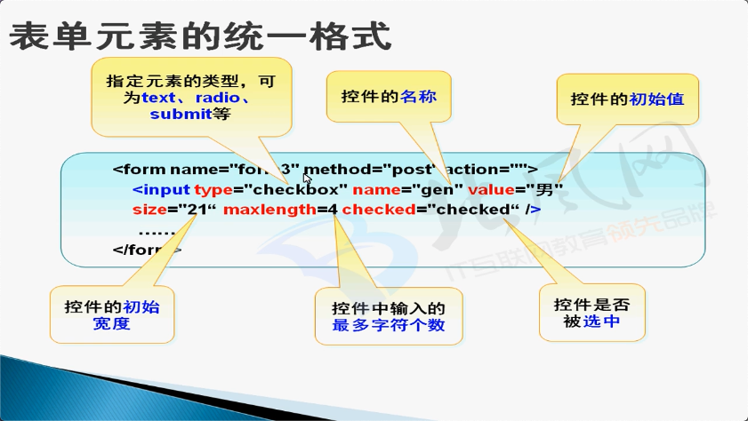

<!-- more -->

### 表格

##### 跨列：<code>colspan</code>

##### 跨行：<code>rowspan</code>

##### 边框的厚度：<code>border</code>

##### 单元格填充：<code>cellpadding</code>

##### 单元格间距：<code>cellspacing</code>

##### 边框颜色：<code>bordercolor</code>

```html
<!DOCTYPE html>
<html lang="en">
<head>
    <meta charset="UTF-8">
    <title>表格</title>
</head>
<body>
    <table border="2">
        <tr>
            <td>移动</td>
            <td>联通</td>
            <td>铁通</td>
        </tr>
        <tr>
            <td>IBM</td>
            <td>惠普</td>
            <td>华硕</td>
        </tr>
    </table>

    <table border="2">
        <tr>
            <td>手机充值、IP卡</td>
          <!-- 跨列 -->
            <td colspan="3">办公设备、文具、耗材</td>

        </tr>
        <tr>
          <!-- 跨行 -->
            <td rowspan="3">各种卡的总汇</td>
            <td>铅笔</td>
            <td>彩笔</td>
            <td>粉笔</td>
        </tr>
        <tr>

            <td>打印</td>
            <td>刻录</td>
            <td>墨盒</td>
        </tr>
        <tr>

            <td>笔记</td>
            <td>钢笔</td>
            <td>墨水</td>
        </tr>
    </table>
  
  	<table border="2" cellpadding="0" cellspacing="0" bordercolor="#f00">
        <tr>
            <td rowspan="2">阿里巴巴旗下网站</td>
            <td>我要买</td>
            <td>我要买</td>
            <td>我要买</td>
        </tr>
        <tr>
            <td colspan="3">您好，欢迎来淘宝！</td>
        </tr>

    </table>
</body>
</html>
```


### 表单

#### 表单所包含的控件

##### 单行文本输入框：<code>text</code>

##### 密码框：<code>password</code>

##### 单选按钮：<code>radio</code>

##### 复选按钮：<code>checkbox</code>

##### 下拉列表：<code>select</code>

##### 重置按钮：<code>reset</code>

##### 提交按钮：<code>submit</code>

##### 多行文本框：<code>textarea</code>

#### 表单元素的统一格式



```html
<!DOCTYPE html>
<html lang="en">
<head>
    <meta charset="UTF-8">
    <title>表单</title>
</head>
<body>
<form action="http://www.baidu.com" method="post">
    <div>登录名：<input type="text" value="叮咚" name="denglu" />(可包含a-z，0-9，下划线)</div>
    <div>密码：<input type="password" value="" name="pass"/>（至少包含6个字符）</div>
    <div>
        再次输入密码：<input type="password" value=""/>
    </div>
    <div>
        性别：<input type="radio" value="男" checked="checked" name="sex"/>男&nbsp;&nbsp;&nbsp;
        <input type="radio" value="女" name="sex"/>女
    </div>
    <div>
        爱好：<input type="checkbox" value=""/>运动&nbsp;&nbsp;&nbsp;
        <input type="checkbox" value=""/>聊天&nbsp;&nbsp;&nbsp;
        <input type="checkbox" value=""/>玩游戏
    </div>
    <div>
        出生日期：
        <select>
            <option>yyyy</option>
            <option>yyyy1</option>
            <option>yyyy2</option>
        </select>年
        <select>
            <option>【选择月份】</option>
            <option>1</option>
            <option>2</option>
        </select>月
        <select>
            <option>1</option>
            <option>2</option>
            <option>3</option>
        </select>日
    </div>
    <div>
        <input type="reset" value="重置"/>
        <input type="submit" value="提交"/>
    </div>
    <div>
        <h3>阅读淘宝协议</h3>
        <textarea rows="7" cols="20" readonly="readonly">
            啊实打实的啊啊da 啊实打实的啊啊da 啊实打实的啊啊da 啊实打实的啊啊da
             啊实打实的啊啊da 啊实打实的啊啊da 啊实打实的啊啊da 啊实打实的啊啊da
             啊实打实的啊啊da 啊实打实的啊啊da 啊实打实的啊啊da 啊实打实的啊啊da
             啊实打实的啊啊da 啊实打实的啊啊da 啊实打实的啊啊da 啊实打实的啊啊da
             啊实打实的啊啊da 啊实打实的啊啊da 啊实打实的啊啊da 啊实打实的啊啊da
        </textarea>
    </div>
</form>
</body>
</html>
```

```html
<!DOCTYPE html>
<html lang="en">
<head>
    <meta charset="UTF-8">
    <title>表单申请表</title>
</head>
<body>
<div style="width: 200px;height: 450px; border: #000 2px solid; background: #f6C;">
    <h3 style="text-align: center;">申请表</h3>
    <form>
        <div>
            姓名：<input type="text" value=""/>
        </div>
        <div>
            密码：<input type="password" value=""/>
        </div>
        <div>
            感兴趣的职业：<br/>
            <input type="radio" value="" name="web" checked="checked"/>web设计
            <input type="radio" value="" name="web"/>web开发
        </div>
        <div>
            其他要求：<br/>
            <textarea rows="10" cols="30" readonly="readonly">包括薪水待遇、工作地点等</textarea>
        </div>
        <div>
            <input type="checkbox" value="" checked="checked"/>发送确认信息
        </div>
        <div>
            经验：<br/>
            <select>
                <option>无经验</option>
                <option>1年经验</option>
                <option>3年经验</option>
            </select>
        </div>
        <div>
            <input type="submit" value="提交"/>
            <input type="reset" value="重置"/>
        </div>
    </form>
</div>
</body>
</html>
```

### 框架：iframe

```html
<!DOCTYPE html>
<html lang="en">
<head>
    <meta charset="UTF-8">
    <title>框架</title>
</head>
<body>
    <a href="http://www.sohu.com" target="frame1">框架去搜狐</a>
    <iframe name="frame1" src="http://www.baidu.com" width="500" height="500" frameborder="0"></iframe>
    <iframe src="表单申请表.html"/>
</body>
</html>
```

### 课后作业

```html
<!DOCTYPE html>
<html lang="en">
<head>
    <meta charset="UTF-8">
    <title>表格分包</title>
</head>
<body>
    <table border="2" cellpadding="0" cellspacing="0">
        <tr>
            <td>分包单位</td>
            <td colspan="2">/</td>
            <td colspan="4">分包项目经理</td>
            <td colspan="3">/</td>
            <td colspan="3">施工班组长</td>
            <td>/</td>
        </tr>
        <tr>
            <td rowspan="2" colspan="2">主控项目</td>
            <td rowspan="2">规范规定</td>
            <td colspan="10">施工单位检查评定记录</td>
            <td rowspan="2">建立单位验收记录</td>
        </tr>
        <tr>
            <td>1</td>
            <td>2</td>
            <td>3</td>
            <td>4</td>
            <td>5</td>
            <td>6</td>
            <td>7</td>
            <td>8</td>
            <td>9</td>
            <td>10</td>
        </tr>
    </table>

    <div>
        搜名字/账号/广播：<input type="text" value=""/>
        <input type="submit" value="搜索"/>
    </div>
    <form>

        <div>
            *姓名：<input type="text" value=""/>
        </div>
        <div>
            *性别：<input type="radio" value="" name="sex"/>女
            <input type="radio" value="" name="sex"/>男
        </div>
        <div>
            *生日：
            <select>
                <option>1998年</option>
                <option>1999年</option>
                <option>2000年</option>
            </select>
            <select>
                <option>1月</option>
                <option>2月</option>
                <option>3月</option>
            </select>
            <select>
                <option>1日</option>
                <option>2日</option>
                <option>3日</option>
            </select>
        </div>
        <div>
            生日显示方式：
            <input type="checkbox" value=""/>年份
            <input type="checkbox" value=""/>月份日期
            <input type="checkbox" value="" checked="checked"/>星座
        </div>
        <div>
            家乡：
            <select>
                <option>国家/地区</option>
            </select>
        </div>
        <div>
            所在地：
            <select>
                <option>中国</option>
                <option>美国</option>
                <option>日本</option>
            </select>
            <select>
                <option>浙江省</option>
                <option>北京市</option>
                <option>山东省</option>
            </select>
            <select>
                <option>德州</option>
                <option>杭州</option>
                <option>北京</option>
            </select>
        </div>
        <div>
            从事行业：<input type="text" value=""/>
        </div>
        <div>
            常用邮箱：<input type="text" value=""/>
        </div>
        <div>
            个人主页：<input type="text" value="http://"/>
        </div>
        <div>
            <textarea cols="20" rows="5">

            </textarea>
        </div>
        <div>
            <input type="submit" value="保存"/>
            <input type="reset" value="重置"/>
        </div>
    </form>
</body>
</html>
```

